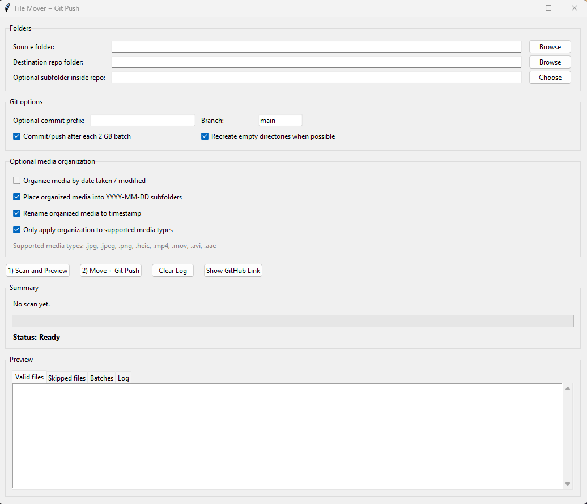

# Mover Git

[](https://github.com/quangshuynh/mover-git/actions/workflows/ci.yml)
[](https://www.python.org/)
[](LICENSE)

Mover Git is a Python and Tkinter desktop utility that previews and moves files into an existing Git repository, then commits and pushes them in size-limited batches. It is designed for controlled archival workflows where file placement, hosting limits, and unrelated Git changes need to remain visible.

## Features

- previews source files, destination paths, skipped files, and batch assignments before moving anything
- skips symbolic links, unreadable files, and individual files larger than 100 MB
- creates batches no larger than 2 GB while preserving file order
- optionally organizes supported photos and videos by date and timestamp
- avoids destination filename collisions without overwriting existing files
- blocks moves when the destination repository already has staged, unstaged, or untracked changes
- stages only files moved by the current operation
- keeps the interface responsive and reports progress, status, and Git output

## Screenshot

<p align="center">
  
</p>

## Workflow

1. Select a source directory.
2. Select an existing local Git repository and an optional subfolder within it.
3. Configure batching, commit, and media organization options.
4. Scan and review the valid, skipped, and batch preview tabs.
5. Start the move and confirm the destructive operation.
6. Review move, commit, and push progress in the log.

Mover Git moves files rather than copying them. Keep backups of important source data and review every preview before confirming.

## Safety

The application validates paths, nesting, repository state, symbolic links, size limits, and destination collisions. Git staging uses explicit repository-relative pathspecs for files moved by Mover Git. It does not run `git add .`, reset unrelated work, or clean the repository.

A Git or filesystem failure is reported in the application log. Files moved before a later Git failure remain in the destination so they can be recovered and committed manually.

## Media Organization

Supported extensions are `.jpg`, `.jpeg`, `.png`, `.heic`, `.mp4`, `.mov`, `.avi`, and `.aae`, matched without regard to case. Images use available EXIF capture dates and otherwise fall back to filesystem modification time. Other supported files use modification time.

Media can be placed in `YYYY-MM-DD` folders and renamed as `YYYY-MM-DD HH_MM_SS.ext`. Numeric suffixes are added when timestamps collide.

## Limits

| Limit | Value |
| --- | ---: |
| Maximum individual file | 100 MB |
| Maximum Git batch | 2 GB |

These are application limits, not guarantees that a Git hosting provider will accept a push. GitHub normally blocks files larger than 100 MiB and recommends Git LFS for large binary assets. Mover Git does not configure Git LFS, retry network failures, or provide transactional rollback.

## Installation

Requirements are Python 3.10 or newer with Tkinter, Git on `PATH`, and an existing destination repository with an `origin` remote and configured authentication.

```bash
python -m venv .venv
python -m pip install -e .
```

Activate the environment first using `.venv\Scripts\Activate.ps1` on Windows or `source .venv/bin/activate` on macOS and Linux. OpenCV remains available as an optional dependency through `python -m pip install -e ".[video]"`.

## Usage

Run the actual application entry point:

```bash
python app.py
```

The destination repository must be clean before a move. Mover Git commits each batch separately by default and pushes the selected branch to `origin`. Disabling per-batch commits moves all valid files first and creates one commit.

## Development

Install development dependencies and run the same checks used by CI:

```bash
python -m pip install -e ".[dev]"
ruff check .
pytest
```

Tests use temporary directories and pure helpers. They do not open Tkinter windows, access a network, use Git credentials, or push to a remote.

## Project Structure

```text
mover-git/
|-- .github/workflows/ci.yml
|-- mover_git/
|   |-- __init__.py
|   |-- core.py
|   |-- git.py
|   `-- media.py
|-- tests/
|   |-- test_core.py
|   |-- test_git.py
|   `-- test_media.py
|-- app.py
|-- pyproject.toml
|-- LICENSE
`-- README.md
```

`app.py` owns the Tkinter interface and background workflow. `mover_git.core` contains path validation, batching, sizes, and commit messages. `mover_git.media` contains media recognition, timestamps, and collision-safe destination naming. `mover_git.git` contains remote parsing and safe staging path helpers.

## Limitations

- no automatic Git LFS setup
- no rollback across completed file moves or commits
- no automatic conflict resolution or push retry
- no remote creation or credential management
- empty directories are not represented by Git unless they contain a tracked placeholder

## License

Released under the [MIT License](LICENSE).
